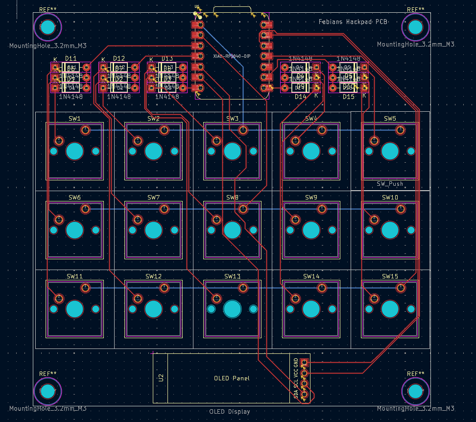
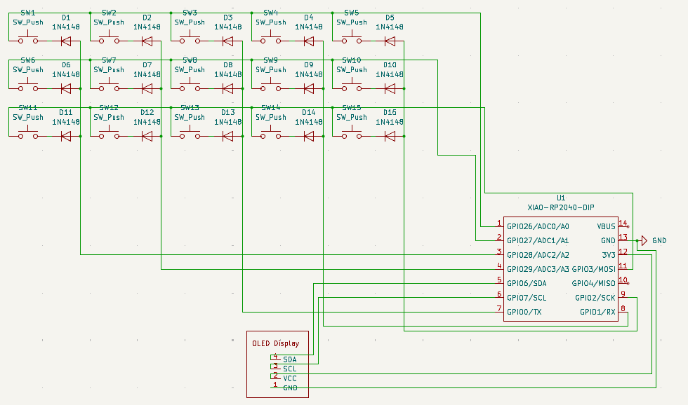
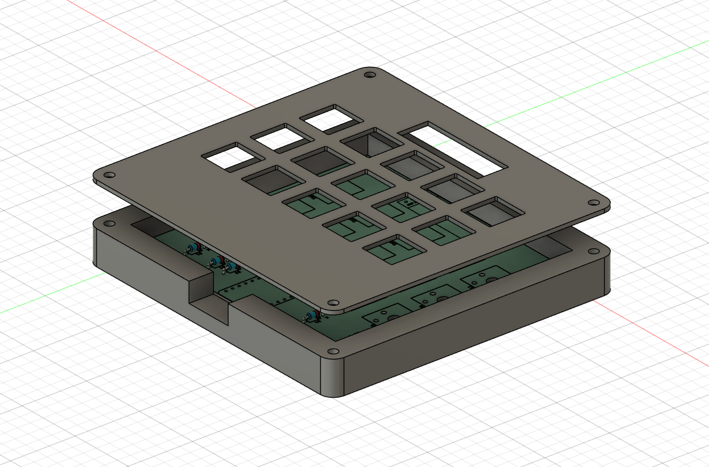

# Hackpad by Fabian
My 15 Key Hackpad build with an OLED Display to keep track of your Uptime.
# Features
- 15x Keys
- 128*32 OLED Display with displayable uptime
# PCB and Schematic
Here are my Pictures of my PCB and Schematic

# CAD

The Top of the Case is connected via 4 Screws. The PCB itselfs is also connected to the Case itself

# Firmware
The firmware is made with QMK. The Keys have no function at the moment but i will use them for macros or for additional keys for video games. The OLED Screen will show you your current uptime.

# BOM
- 1 SEEEDUINO XIAO RP2040
- 15x MX-Style switches
- 5x 1N4148 Diodes
- 8x M3x16mm screws
- 1x 0.91 inch OLED displays
- 1x 3D-Printed Case

# Bonus 
This is my first time doing something like this. I really enjoyed making all the things espacially wiring the PCB. I really hope that the Firmware works as intentendet, if not i will try to fix it.